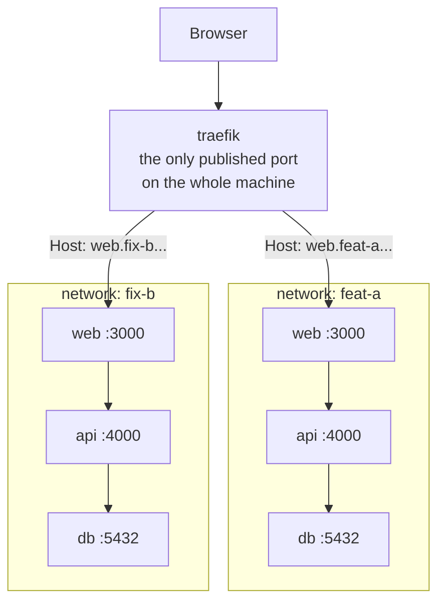

<p align="center">
  
</p>

<p align="center">
  <b>Every git worktree gets its own running stack, on its own ports.</b><br>
  Work on three branches at once. Nothing collides. Nothing is configured twice.
</p>

```bash
grove new feat/login       # branch + worktree + deps + ports + running
grove run pnpm test:e2e    # BASE_URL, API_URL, DATABASE_URL injected
grove rm feat-login        # worktree, containers, volumes, ports - all of it
```

---

## The problem

You are on `feat/login`. Someone reports a bug on `main`. You stash, switch, wait
for the stack to come back, fix it, switch back, and wait again.

So you make a second worktree - and everything collides. Two apps want `:3000`.
Two databases want `:5432`. You start renumbering by hand, and that number
ripples through six env files across three layers.

## Why "grove"

A grove is a stand of trees growing together. That is the product: several git
worktrees, each one fully alive at the same time.

## The idea

**Ports only collide on the host.** A Docker network is a separate address space,
so two worktrees can both run `web:3000` and `db:5432` and never meet. Compose
already gives you one network per project name; what it does not give you is a
way back in. That is the proxy's only job.



Identical port numbers in both, and they never meet. The only thing that has to
be unique is the hostname, and that comes from the worktree name.

The hostname is the routing key, so no port ever appears in a URL. Everything
*inside* the stack - `DATABASE_URL`, service-to-service calls - is byte-identical
in every worktree. Only browser-facing URLs vary, and they come from `${WT_NAME}`.

**And when there is no Docker at all**, the same idea reduces to its useful core:
`grove` leases a distinct host port per worktree and hands it to the process
through a config file or the environment. See
[Stacks Docker doesn't run](#stacks-docker-doesnt-run).

## Install

```bash
npm install -g grovekit
```

One binary: `grove`.

## Quick start

```bash
cd your-repo
grove install          # agent skill, /setup-grove command, session hooks, .gitignore
```

Then, in Claude Code:

```
/setup-grove
```

The agent reads your repo, works out what the services are and which ports are
pinned, writes `worktree.toml`, boots it, and reports back. You review the diff
and commit it - **to your default branch**, since a worktree inherits its
branch's files.

After that, day to day:

```bash
grove new feat/thing       # branch, worktree, deps, ports, started
cd ../your-repo-feat-thing
```

Open a second terminal, do the same for another branch, and both run at once.

## Commands

| | |
|---|---|
| `grove new <branch>` | branch, worktree, hydrate, start - one call |
| `grove new --seed-from <wt>` | the same, starting from another worktree's data |
| `grove up [services...]` | start and block until healthy; idempotent |
| `grove down [services...]` | stop, keeping volumes, data and leases |
| `grove restart [services...]` | stop and start again - only what you name |
| `grove rm <worktree>` | delete a worktree and everything it owns |
| `grove gc` | reclaim containers, volumes and leases nothing owns |
| `grove run <cmd...>` | run with this worktree's environment injected |
| `grove status` | this worktree: services, ports, health |
| `grove ls` / `grove ls --all` | this repo's worktrees / every one on the machine |
| `grove logs [services...]` | container or captured process logs |
| `grove hydrate` | re-copy gitignored files from the main worktree |
| `grove seed` | what a new worktree could start from; `--from <wt>` copies it |
| `grove adapt <step>` | migrate a repo: evidence -> decide -> render -> validate |
| `grove install` | agent skill, slash command, hooks |
| `grove doctor` | check the environment and the migration |

Every command takes `--json`. **Human output can change freely; `--json` is a
contract.**

### Start only what you need

Full stacks are expensive and several may be running at once.

```bash
grove up                    # everything
grove up api db             # those, plus their dependencies
grove up --group backend    # a named set from worktree.toml
grove up api --no-deps      # exactly api
```

What you leave out is `not-started` - a distinct state from `unhealthy`. The
stack still reports `ready`, and nothing will try to "repair" a service you left
out on purpose. Adding one later (`grove up web`) extends the set without
restarting what is already running.

### Starting from another worktree's data

A new worktree gets an empty database. When the data comes from the repo -
migrations plus a seed script that run on boot - that is exactly right, and this
section is not for you.

It is for the other case: the data got there by restoring a dump, and no new
worktree can reproduce it. That is the reason people give up on isolation and go
back to one shared database, where a migration on one branch breaks everyone
else's.

```bash
grove new feat/thing --seed-from main
```

`pg_dump` in one container piped straight into `pg_restore` in the other, before
the application starts. Nothing lands on disk in between, so a database larger
than your free space still copies. Postgres, MySQL/MariaDB and Mongo are
recognised by image; the credentials come from the running container rather than
from a re-parse of the compose file.

Afterwards they are still two databases. The copy shares a starting point, not a
schema: migrating one branch cannot reach the other.

**It costs what the data weighs.** The copy dominates the time `grove new` takes
and scales with the size of the database, not the repo. Run interactively, grove
measures the source first and offers the copy with the size attached, so the wait
is a choice:

```
main has data worth copying: db (260 MB)
The new worktree would start from the same data instead of an empty database.
The copy is what dominates how long this takes - expect minutes on a large one.
Copy it? [y/N]
```

An agent is never asked - a prompt nobody is reading is a hang - so `--json`
without `--seed-from` simply does not copy. To make it the default for everyone,
name the source in `worktree.toml`:

```toml
[seed]
from = "main"
```

`--no-seed` overrides that and skips it.

A named source is obeyed as given. `--seed-from` copies even when the database
looks empty: the size check exists to decide whether to interrupt you, never to
overrule you. A command that reports success and quietly did not do the thing is
the worst outcome available.

To see what is there without copying anything:

```bash
grove seed          # or --json
```

```
main - what a new worktree could start from
  db (postgres)  260 MB, about 1,400,000 rows

copy it with: grove new <branch> --seed-from main
```

That command exists for the agent as much as for you. `grove new` cannot prompt
an agent - a question nobody is reading is a hang - so the asking has to happen
one level up, in the session. The installed skill tells the agent to run
`grove seed --json` before every `grove new`, and to put the question to you with
the size in it when it finds a database with data. It decides nothing on its own:
if you say yes it passes `--seed-from`, if you say no it passes `--no-seed`, so
the command records what was chosen.

`grove seed --from <worktree>` does the copy into a worktree that already exists,
replacing its data.

### Everything is scoped to your worktree

`down`, `restart` and `rm` cannot reach another worktree. Containers are
addressed by the Compose project name - which *is* your worktree's slug - and
host processes by that worktree's own ledger. This is asserted by tests, not
merely believed.

`grove ls --all` shows every worktree on the machine with its ports: the command
for "who is holding that port?"

## Setup

Two files next to your compose file. **`docker-compose.yml` is never modified.**

**`docker-compose.worktree.yml`** - an overlay, applied with `-f base -f overlay`:

```yaml
services:
  api:
    ports: !reset []                     # cancel the base file's published ports
    networks:
      internal: { aliases: [api.internal] }
      wt-proxy: {}
    labels:
      - traefik.enable=true
      - traefik.http.routers.${WT_NAME}-api.rule=Host(`api.${WT_NAME}.${WT_DOMAIN}`)
      - traefik.http.services.${WT_NAME}-api.loadbalancer.server.port=4000

  db:
    ports: !override ["${WT_PORT_DB}:5432"]   # leased host port - see gotchas
    networks: [internal]

networks:
  internal:
  wt-proxy:
    external: true
    name: ${WT_PROXY_NETWORK}
```

**`worktree.toml`** - what each service is, and how to tell it is up:

```toml
[project]
name = "sample-app"
compose = ["docker-compose.yml", "docker-compose.worktree.yml"]

[[services]]
name = "api"
layer = "backend"
subdomain = "api"          # becomes api.<worktree>.localtest.me
port = 4000
health = "/healthz"

[[services]]
name = "db"
layer = "data"
host_port = true           # leased, so you can open it in a GUI client
health = { exec = ["pg_isready", "-U", "app"] }

[groups]
backend = ["api", "db"]    # grove up --group backend

[env]
DATABASE_URL = "postgres://app:app@${WT_HOST_DB}/app"

# Gitignored files git will not bring to a new worktree.
[hydrate]
copy = [".env", "apps/*/.env.local"]
link = ["node_modules", "apps/*/node_modules"]
run  = ["pnpm install --frozen-lockfile"]
```

Copy what you may edit per worktree; link what is large and identical. `grove`
decides between `link` and `run` by hashing the lockfiles: identical means one
`node_modules` is safe to share, different means the branch changed its
dependencies and it installs instead.

A complete working pair lives in [`examples/sample-app`](examples/sample-app).

Unknown keys are rejected. A misspelled option that parses fine and does nothing
is the most expensive kind of typo, so there is no such thing here.

## Stacks Docker doesn't run

Not every repo is containerised. An orchestrator that launches its own child
processes, a compiled server, a dev server you start yourself - these bind host
ports directly, so there is no Docker network to hide identical ports inside and
the proxy has nothing to route to.

What still collides is the port, and that part `grove` can own:

```toml
[project]
name = "my-app"
compose = []               # nothing containerised at all - that's allowed

[[services]]
name = "server"
runtime = "host"           # not a container
start = "./scripts/dev-server"
health = { tcp = true }

[[services]]
name = "api-grpc"
runtime = "host"           # no `start` - just reserve the port
health = { tcp = true }

# Hand the leases back through a file the app already reads.
[render]
"config/ports.generated.json" = """
{ "ports": { "apiGrpc": ${WT_PORT_API_GRPC} } }
"""

# ...or through the environment, for anything read from there.
[env]
SERVER_URL = "https://localhost:${WT_PORT_SERVER}"
```

`grove up` renders the config, starts the process with that environment, records
its pid and waits for it to answer - the same contract a container gets. `down`
stops it and everything it spawned; `logs` shows its captured output; a rendered
file that changes restarts the process that reads it.

A service with **no `start`** is a port reservation `grove` watches but does not
own: never `unhealthy`, never blocking the stack from `ready`. Only what `grove`
launches is what `grove` reports on.

## The manifest

`.wt/manifest.json`, inside the worktree so a relative read always resolves.
Written on success *and* on failure, with logs attached, so a consumer learns
which layer broke and why.

```json
{
  "schemaVersion": 1,
  "worktree": "fix-billing",
  "status": "ready",
  "scope": ["api", "db"],
  "baseUrl": "http://web.fix-billing.localtest.me:8081",
  "services": [
    { "name": "api", "status": "ready", "url": "...", "internalUrl": "http://api.internal:4000" },
    { "name": "db",  "status": "ready", "hostAddress": "localhost:23229" },
    { "name": "web", "status": "not-started" }
  ]
}
```

`status: ready` means everything in `scope` is ready. `not-started` means the
service was never asked for - it is not a failure, and consumers must not try to
repair it. That distinction is the whole reason partial startup is safe.

## Agent integration

`grove install` writes:

- `.claude/skills/grove/SKILL.md` - the daily-use skill
- `.claude/commands/setup-grove.md` - the `/setup-grove` migration command
- `SessionStart` / `SessionEnd` hooks, **merged** into `.claude/settings.json`
  rather than overwriting it
- `.wt/` in `.gitignore`, and an `AGENTS.md` section if that file exists

`SessionStart` tells each session its **own** addresses:

```
grove: worktree `feat-login` (branch feat/login), stack ready.
  Addresses for THIS worktree - use these, never a hardcoded port:
    web                http://web.feat-login.localtest.me:8081
    api                http://api.feat-login.localtest.me:8081
    db                 localhost:21750
  Also running: fix-billing (23906 20694 21008 +12).
  Those belong to other worktrees. Do not use their ports, or stop them.
```

The hook command is resolved at install time and **verified to be this package**.
A hook pointing at a binary that is not on PATH fails silently, which is worse
than not installing one at all.

`SessionEnd` does nothing unless you set `[hooks] on_session_end = "down"`: that
hook has no turn to render a question into, so only reversible actions belong
there.

## Gotchas this project learned the hard way

Every one was found by running it, not by reading docs. The full list, with what
each cost, is in [DESIGN.md](DESIGN.md).

**`!reset` erases, `!override` replaces.** `ports: !reset ["8080:80"]` publishes
*nothing* - the value is ignored. `grove doctor` checks for it.

**Traefik must be >= 3.6 on Docker Engine 29+.** Earlier 3.x negotiates a Docker
API version below 1.44, which Engine 29 rejects. Traefik still starts and still
answers - with 404 for everything, and only its container logs say why.

**Every service on the shared network needs a `<name>.internal` alias.** A bare
`api` is ambiguous there, because every worktree has one. It works with a single
worktree and goes wrong with two.

**A socket probe cannot predict whether Docker can publish a port.** On Windows a
port can be reserved such that `docker run -p` fails while a plain `listen` on
`0.0.0.0` succeeds. Docker is the only authority.

**Never commit `.wt/`.** A committed `state.json` makes a new worktree inherit
another's identity and drive its containers. `grove install` writes the
`.gitignore` entry for you.

**`*.localhost` does not resolve via the Windows resolver.** Chrome handles it
internally; `curl`, Node `fetch` and Playwright do not. Default to `localtest.me`.

**`NEXT_PUBLIC_*` / `VITE_*` are baked at build time.** Setting them under
`environment:` does nothing for the browser bundle - use `build.args`, or serve a
runtime `/env.js`.

**Watch for launcher wrappers that override the environment.** Some run commands
apply their own profile's variables *over* the ambient ones, so an injected port
is silently ignored and the process comes up on its hardcoded one.

## Development

```bash
npm install
npm run typecheck
npm test                       # 203 tests, no Docker needed
WT_TEST_DOCKER=1 npm test      # adds the suite that boots real stacks
npm run build
```

Docker tests each use their own branch, and therefore their own Compose project,
containers and port leases - they will not touch a stack you have running.

## License

MIT
